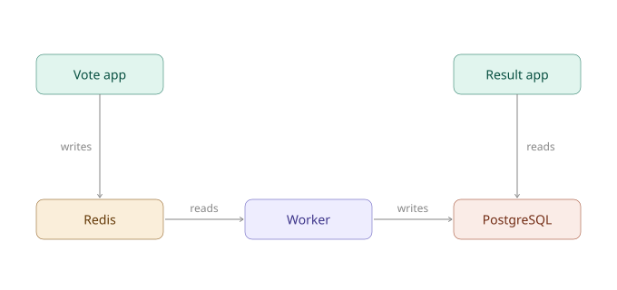

# voting-app-k8s

A production-style deployment of the [Docker Example Voting App](https://github.com/dockersamples/example-voting-app) on AWS EKS, provisioned end-to-end with Terraform. The project covers the full path from infrastructure to running application: VPC networking, an EKS cluster with autoscaling node groups, RDS (PostgreSQL) and ElastiCache (Redis) in place of in-cluster databases, ECR for container images, and IAM/OIDC-based authentication for both GitHub Actions and in-cluster workloads.

On the Kubernetes side, it covers Deployments, Services, ConfigMaps, and RBAC, along with External Secrets Operator for syncing database credentials from AWS Secrets Manager, and the AWS Load Balancer Controller for exposing services to the internet via Ingress/ALB. Deployment is automated through a GitHub Actions pipeline using OIDC federation — no long-lived AWS credentials stored in CI.---

## Architecture



---

## Prerequisites

- `kubectl`
- `terraform`
- `helm`
- `aws cli`

## Deployment Steps

### 1. Provision infrastructure

```bash
terraform apply
```

### 2. Point kubectl at the cluster

```bash
aws eks update-kubeconfig --region ap-southeast-1 --name voting-app-eks
kubectl get nodes
```

### 3. Push application images to ECR

Run the **"Build and Push"** GitHub Action to build and push `vote`, `worker`, and `result` images to their ECR repositories.

### 4. Verify GitHub Actions variables

Confirm the following variables are up to date before deploying:

- `RDS_ENDPOINT`
- `REDIS_ENDPOINT`
- `POSTGRES_SECRET_NAME` — needs update every rebuild
- `IMAGE_TAG` — needs update every deploy

### 5. Manually bootstrap cluster-scoped resources

These cannot be applied by the CI/CD pipeline (its IAM role is deliberately scoped to namespace-level, non-cluster-scoped resources). Apply them yourself, using your own admin access:

```bash
kubectl apply -f manifests/rbac.yaml
kubectl apply -f manifests/clustersecretstore.yaml
```

Verify:

```bash
kubectl auth can-i create deployments \
  --as=arn:aws:iam::653236170203:role/VotingAppEKSKubernetesDeploymentRole \
  --as-group=k8s-deploy-group -n default
kubectl get clustersecretstore aws-secretsmanager
```

### 6. Deploy the application

Run the **"Deploy to EKS"** GitHub Action. This will:

- Substitute account ID, region, endpoints, secret name, and image tag into the manifests
- Apply the `ExternalSecret` and wait for it to sync
- Apply the ConfigMap and Deployments
- Restart deployments to pick up any ConfigMap/Secret changes
- Verify rollout status

### 7. Verify

```bash
kubectl get pods -n default
kubectl get ingress -n default
```

Open the ALB address shown in `kubectl get ingress` to confirm `vote` and `result` are reachable.

## Teardown

**Always delete Ingress objects before destroying infrastructure.** The AWS Load Balancer Controller creates real ALBs outside of Terraform's state — if they're not removed first, `terraform destroy` will fail (or hang) trying to detach the Internet Gateway, since the ALB still holds a public IP in the VPC.

```bash
kubectl delete ingress --all --all-namespaces
aws elbv2 describe-load-balancers --query "LoadBalancers[*].LoadBalancerName"   # confirm none remain
terraform destroy
```

If `terraform destroy` fails with a Kubernetes credentials/permissions error, your personal admin access entry may have been removed before other resources needing live cluster access. Re-add it manually and retry:

```bash
aws eks create-access-entry \
  --cluster-name voting-app-eks \
  --principal-arn arn:aws:iam::653236170203:user/bav-admin-user

aws eks associate-access-policy \
  --cluster-name voting-app-eks \
  --principal-arn arn:aws:iam::653236170203:user/bav-admin-user \
  --policy-arn arn:aws:eks::aws:cluster-access-policy/AmazonEKSClusterAdminPolicy \
  --access-scope type=cluster

terraform destroy
```

## Known Gotchas

- **Stale kubeconfig**: every cluster recreate produces a new API endpoint. Always re-run `aws eks update-kubeconfig` after a rebuild.
- **ESO credential timing**: if `ClusterSecretStore` shows `InvalidProviderConfig` with an IMDS-related error, the ExternalSecrets pod likely started before its Pod Identity association existed. Restart it:
  ```bash
  kubectl rollout restart deployment/external-secrets -n external-secrets
  ```
- **Node pod capacity**: a single `t3.small` node can run out of pod slots quickly. Check `desired_size`/`min_size` in the node group if pods are stuck `Pending` with a "Too many pods" event.

## Reference

- Original application: [dockersamples/example-voting-app](https://github.com/dockersamples/example-voting-app)
